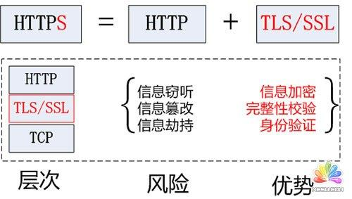

## http 不安全的原因

HTTP 设计目的在于数据传输和共享

-   数据没有加密

-   无法验证身份

    http 标准中没有校验对端身份的标准

-   数据易篡改

    没有机制保证数据完整性

### 解决这三个问题的通用方案就是是实现 TLS/SSL 协议。

TLS/SSL 协议在网络层协议中的定位如下

  

TLS/SSL 构建在 TCP 协议之上，使用 TCP 协议保证数据传输的可靠性，任何数据到达 TCP 之前都经过 TLS/SSL 协议处理。

OpenSSL 是一个底层密码库，实现了 TLS/SSL。

TLS/SSL 四大目标

-   数据是机密的
-   互操作性
-   可扩展性
-   效率

三大核心

-   认证
-   秘钥协商
-   数据加密
