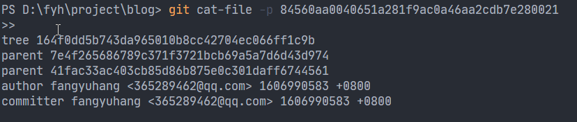
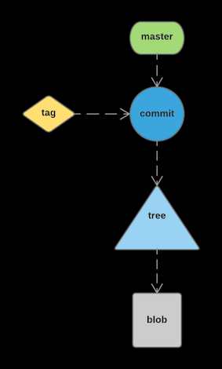

.git 目录

### hooks（钩）

> 存放一些 shell 脚本

### Info:exclude

> 存放仓库的一些信息

### logs

> git 操作日志

### refs（refs：heads、remote）

> refs/heads 放仓库的分支信息,分支名做文件名，比如 master 文件，内容是仓库文件用 sha-1 算法算出的 40 位的 hash,用 git cat-file -p hash 值查看内容如图（其实是 git 的 commit 对象）,。
> tags

### index 文件

> git add 暂存的索引信息

### HEAD 文件

> HEAD 指针指向哪一个分支，如 ref: refs/heads/master，指向 master 分支

### description 文件

> 仓库的描述信息，主要给 gitweb 等 git 托管系统使用

### COMMIT_EDITMSG 文件

> git commit 提交的最新的注释信息

### ORIG_HEAD 文件

> 针对某些 危险操作 ，Git 通过记录 HEAD 指针的上次所在的位置 ORIG_HEAD 提供了回退的功能。当你发现某些操作失误了，比如错误的 reset 到了一个很早很早的版本，可以使用 git reset --hard ORIG_HEAD 回退到上一次 reset 之前。
> 每一次移动 HEAD 指针，Git 都会将移动的路径通过链表串起来，链表头部的 HEAD@{0}即 HEAD 指针。
> 但是 HEAD@{1}并不一定是 ORIG_HEAD！注意到，ORIG_HEAD 仅仅是当进行 危险操作 （比如 merge）时才会变更为 HEAD 指针的原值，而 HEAD@{}链表则记录了每次 HEAD 的移动（包括 commit）。
> git reflog 查看 HEAD@{}链表
> 显然，有了 reflog 命令后 HEAD 链表比不知道什么变过的 ORIG_HEAD 更好用，因此如果你使用的是 1.8.5 版本之后的 Git，推荐使用 HEAD{}链表来代替 ORIG_HEAD 指针。

### config 文件

> git 仓库的配置文件

### objects 文件夹（很重要）

> 保存了暂存区的所有文件对象，包括 blob 对象、tree 对象、commit 对象等，这些对象都是一以文件的形式来保存的
> git add 做了啥？
> 其实，在执行 git add 命令的时候，git 首先会通过 hash 函数算出文件名 A.java 对应的 sha-1 值是 1fed2a34f13dd2a34f13d，这个 code 是一个 32 位的 16 进制数，git 会取这个 code 的前两位作为文件夹名在.git/objects 文件夹中创建一个文件夹 1f，取 code 的后 30 位作为文件名，在.git/objects/1f 中创建一个文件 ed2a34f13dd2a34f13d，git 会将 A.java 的文件内容通过一定的压缩保存在这个文件中

### 其他

> git 还提供了另一种排出的方式来做同样的事情，即在.git/info/exclude 这里设置的你要排出的文件。他不会影响到其他人，也不会提交到版本库中去。请注意与第一种方法的区别！

> .gitignore 还有个有意思的小功能，一个空的 .gitignore 文件可以当作是一个 placeholder。如当你需要为项目创建一个空的 log 目录时，这就变的很有用。使用方法：创建一个 log 目录在里面放置一个空的.gitignore 文件，当你 clone 这个 repo 的时候 git 会自动的创建好一个空的 log 目录了。

> 如果已经 git add 之后想删除某条记录，可以使用 git rm 来从记录文件里删除记录避免被 commit 执行。
> 删除以前提交的 commit，可 push push -f origin。

> 暂存区是一个 commit 对象

### 对象类型

> Git 放在对象库里的对象只有 4 种类型：块(blob)、目录树(tree)、提交(commit)和标签(tag)。就是由这 4 种对象构成 Git 高层数据结构的基础。

##### 块-blob

> 文件的每一个版本表示为一个块(blob)。一个 blob 保存一个文件的数据，但不包含任何关于这个文件的元数据，甚至连文件名也没有。

##### 目录树-tree

> 一个目录树对象代表一层目录信息，它记录 blob 标识符、路径名和在一个目录里所有文件的一些元数据。

##### 提交-commit

> 一个提交对象保存版本库中一次变化的元数据，包括作者、提交者、提交日期和日志消息。每一个提交对象指向一个目录树对象，而这个目录树对象在一张完整的快照中捕获提交时版本的状态。

##### 标签-tag

> 一个标签对象分配一个任意的且人类可读的名字给一个特定对象，通常是一个提交对象。

##### 小结

> 其中一个 commit 会包含一个 tree 指向，也会包含一个 parent 指向，首个 commit 没有 parent;一个 tree 包含一个或多个 blob，同样也可能包含零个或多个 tree 的指向；blob 里面保存一个文件的数据，仅仅是数据，不包含其它的内容，不同的文件名，只要内容相同，都指向同一个 blob。
> 
